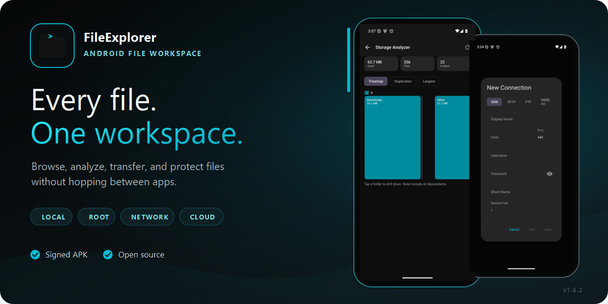
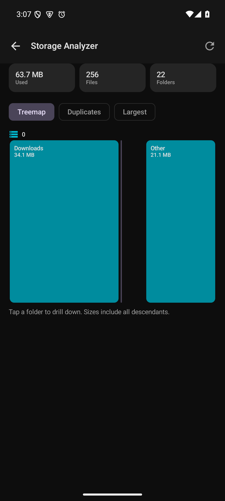
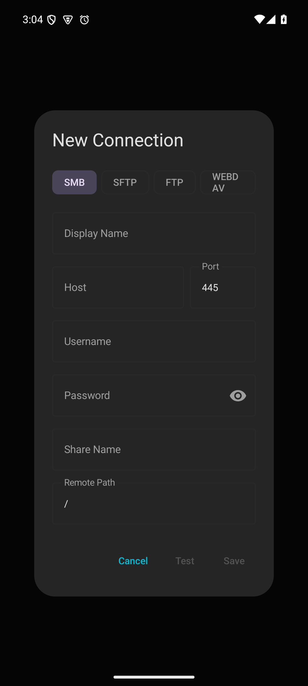
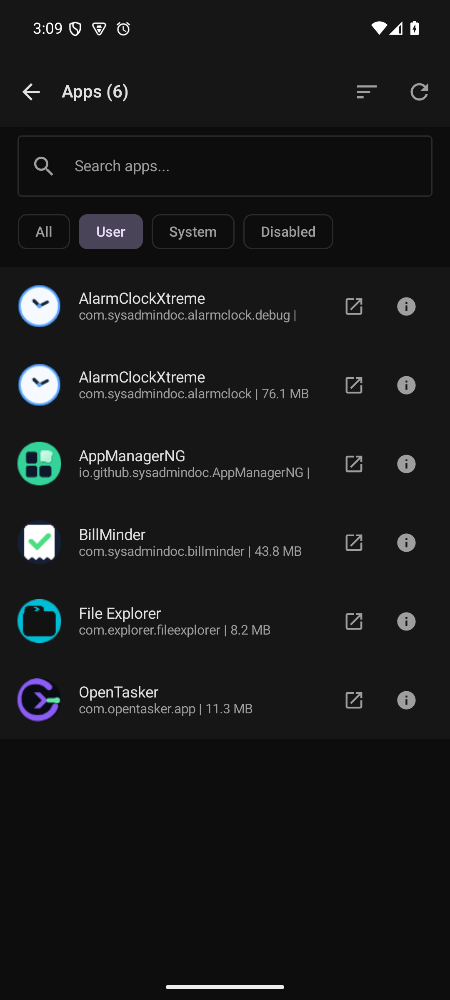
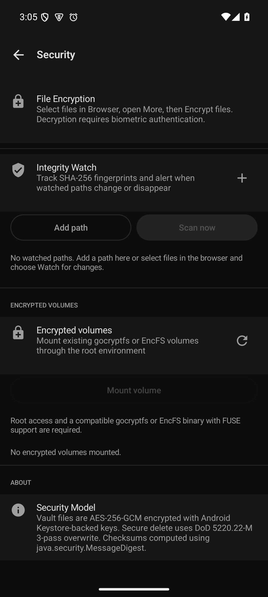
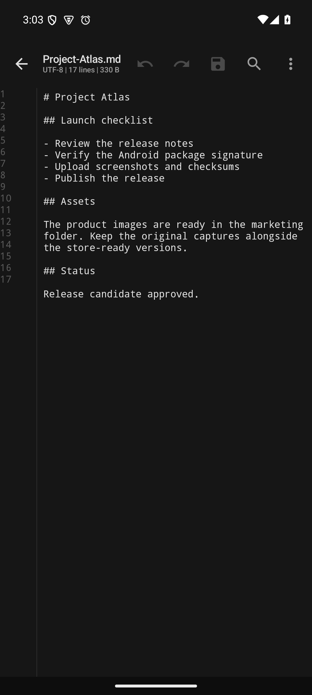
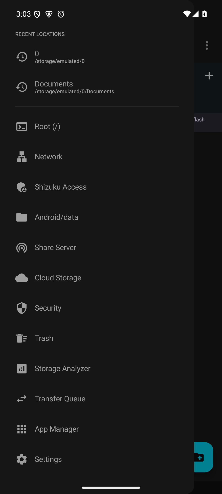

# FileExplorer

[](https://github.com/SysAdminDoc/FileExplorer/releases/latest)
[](#requirements)
[](LICENSE)
[](https://github.com/SysAdminDoc/FileExplorer/stargazers)



FileExplorer is an open-source Android file manager for people who need more than a basic document picker. It brings local storage, root folders, archives, remote shares, and optional cloud accounts into one workspace. A built-in editor, storage analyzer, app manager, encrypted vault, and recoverable transfer queue handle the jobs that usually require several apps.

No ads. No behavioral analytics. Local file work does not require an account.

[Download the signed APK](https://github.com/SysAdminDoc/FileExplorer/releases/download/v1.6.2/FileExplorer-v1.6.2.apk) · [See what changed](CHANGELOG.md) · [Review every capability](docs/CAPABILITIES.md)

## See it in action

These screens come from a real Android emulator running FileExplorer.

<table>
  <tr>
    <td width="33%"><br><sub>Find large folders and duplicate candidates before cleaning anything.</sub></td>
    <td width="33%"><br><sub>Connect to SMB, SFTP, FTP or WebDAV without changing apps.</sub></td>
    <td width="33%"><br><sub>Inspect installed apps and open package details.</sub></td>
  </tr>
  <tr>
    <td width="33%"><br><sub>Encrypt files and watch checksums. Supported rooted devices can mount existing volumes.</sub></td>
    <td width="33%"><br><sub>Edit text and code without leaving the current folder.</sub></td>
    <td width="33%"><br><sub>Jump from everyday folders to root, network, cloud, security, and analysis tools.</sub></td>
  </tr>
</table>

## Why people use it

- Keep common file work in one place. Browse, search, preview, rename, archive, tag, edit, and share from the same app.
- Move serious batches with a persistent queue. Jobs can pause, resume, survive process death, and report partial completion honestly.
- Reach the storage you actually use. Local volumes work immediately. Root, Shizuku, USB, remote, and cloud locations appear only when their requirements are met.
- See support before acting. Provider-aware controls do not present an unsupported remote operation as a successful one.

## What is included

| Job | FileExplorer support |
|---|---|
| Browse and organize | Tabs, dual-pane mode, grid or list views, breadcrumbs, bookmarks, tags, saved searches, recent locations, and smart collections |
| Inspect files | Image thumbnails, PDF rendering, DOCX/XLSX/EPUB previews, APK analysis, hex view, checksums, directory sizes, and storage analysis |
| Edit and package | Text editor, batch rename, ZIP/7z/TAR creation, archive browsing, and bounded extraction safeguards |
| Move data | Recoverable copy and move queue, conflict previews, deterministic keep-both names, Trash, Quick Share, and a local share server |
| Work remotely | SMB, SFTP, FTP/FTPS, WebDAV, plus optional Google Drive, Dropbox, and OneDrive builds |
| Protect sensitive files | Android Keystore-backed credentials, an AES-256-GCM vault, file encryption, biometric gates, integrity watches, and capability-aware deletion |
| Go beyond stock Android | Optional root access, Android/data access through Shizuku, USB OTG, installed-app management, automation intents, and a certificate-bound plugin API |

The [capability guide](docs/CAPABILITIES.md) separates ready features from those that need root, another service, hardware, or external credentials.

## Install

### Download a release

1. Open the [latest release](https://github.com/SysAdminDoc/FileExplorer/releases/latest).
2. Download `FileExplorer-v1.6.2.apk` and its checksum file.
3. Allow installation from your browser or file manager if Android asks.
4. Open FileExplorer and choose full shared-storage access or limited app-storage mode.

Release APKs are signed. The release page includes SHA-256 checksums and the signing certificate fingerprint so you can verify what you install.

### Storage access

Android 11 and newer require All Files Access for a traditional file manager to browse all shared storage. If you decline, FileExplorer stays usable inside its app-specific folder and through Android's system picker. Root is optional.

## Connections and optional features

| Location | What you need |
|---|---|
| SMB, SFTP, FTP/FTPS, WebDAV | A reachable server and your connection details |
| Root folders | A rooted device with a supported root manager |
| Android/data and Android/obb | A separately running Shizuku or Sui service |
| USB storage | A connected drive and a one-time Android folder grant |
| Google Drive, Dropbox, OneDrive | A build configured with the provider's OAuth client credentials |
| Chromecast | Google Cast services and a receiver on the same network |

The public APK does not contain production cloud client secrets. Cloud entries remain visibly unavailable until a configured build can launch the real provider sign-in flow.

## Privacy and security

FileExplorer has no advertising SDK and no behavioral analytics SDK. Network access is used when you choose a remote location, cloud provider, cast target, advisory scan, or local share server.

Saved network passwords use Android Keystore-backed encryption. Vault payloads use AES-256-GCM with opaque names and an authenticated index. Secrets, vault files, and the app database are excluded from Android cloud backup.

Flash storage and copy-on-write filesystems cannot promise forensic erasure. FileExplorer labels secure deletion as best effort and reports unsupported provider behavior instead of claiming a guarantee.

Read [SECURITY.md](SECURITY.md) for the threat boundaries, permission rationale, and private reporting link.

### Permission and distribution summary

| Permission or component | Purpose | API range | If denied | Backup implication | Distribution status |
|---|---|---|---|---|---|
| `MANAGE_EXTERNAL_STORAGE` | Whole-device shared-storage browsing | Android 11+ | Limited app storage and Android's picker remain available | Permission state is not backed up | Restricted permission. Owner review is required before Play submission |
| Legacy and granular media permissions | Shared storage on older Android versions and selected media access on newer releases | Android 8+ | App-scoped and picker-granted files remain available | Permission state is not backed up | Compatibility and optional runtime access |
| `QUERY_ALL_PACKAGES` | Complete App Manager inventory and APK inspection | Android 11+ | App Manager falls back to launcher-visible packages | Package metadata and APKs are not backup data | Restricted permission. Owner review is required before Play submission |
| `FileDocumentsProvider` | Makes FileExplorer available in Android's Storage Access Framework | Android 8+ | The main browser still works | Provider roots and grants are not restored | Export is protected by Android's `MANAGE_DOCUMENTS` permission |
| Transfer and share services | Keeps active transfers and local sharing visible and cancellable | Android 8+ | Work remains visible in the app when notifications are declined | Credentials stay excluded from backup | Services are internal and declare Android 15 timeout handling |

## Requirements

- Android 8.0 or newer (API 26+)
- Full shared-storage access for whole-device browsing, or limited mode for app storage
- Root, Shizuku, remote servers, cloud credentials, and Cast hardware only for the matching optional features

## Build it

Use Android SDK 36 and JDK 21. The project has 19 Gradle modules and targets JVM 17 bytecode.

```powershell
git clone https://github.com/SysAdminDoc/FileExplorer.git
cd FileExplorer
$env:JAVA_HOME = "C:\Program Files\Eclipse Adoptium\jdk-21.0.12.8-hotspot"
.\gradlew.bat --no-daemon --console=plain :app:assembleDebug
```

Release signing values belong in an ignored `signing.properties` file or the documented environment variables. The repository never needs a committed keystore.

Run the local release checks before distributing a build:

```powershell
.\gradlew.bat --no-daemon --console=plain test
.\gradlew.bat --no-daemon --console=plain verifyAccessibilityLocalization
.\gradlew.bat --no-daemon --console=plain verifyAndroidUpgradeReadiness verifyDependencyProvenance
.\gradlew.bat --no-daemon --console=plain scanDependencyAdvisories
.\gradlew.bat --no-daemon --console=plain releaseSmoke
```

The [development guide](docs/DEVELOPMENT.md) covers the module layout, plugin contract, automation intents, cloud setup, and release gates.

## Contributing

Bug reports and focused pull requests are welcome. Include the Android version, storage provider, steps to reproduce, and any redacted diagnostic output that helps explain the failure.

## License

[MIT](LICENSE)
